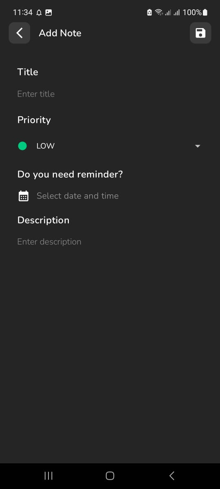
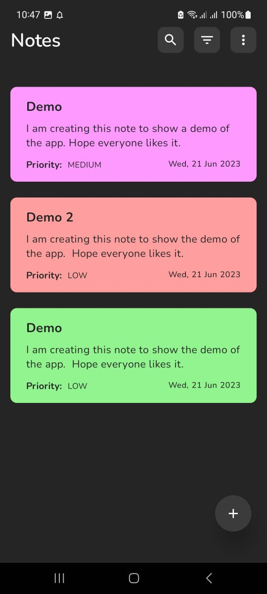
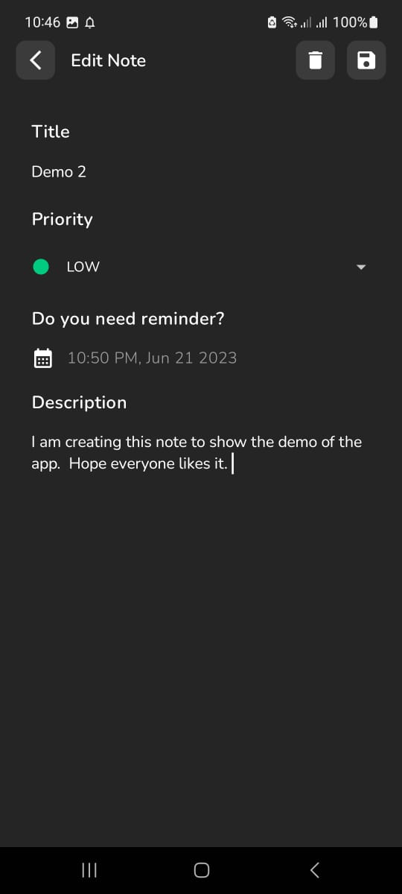
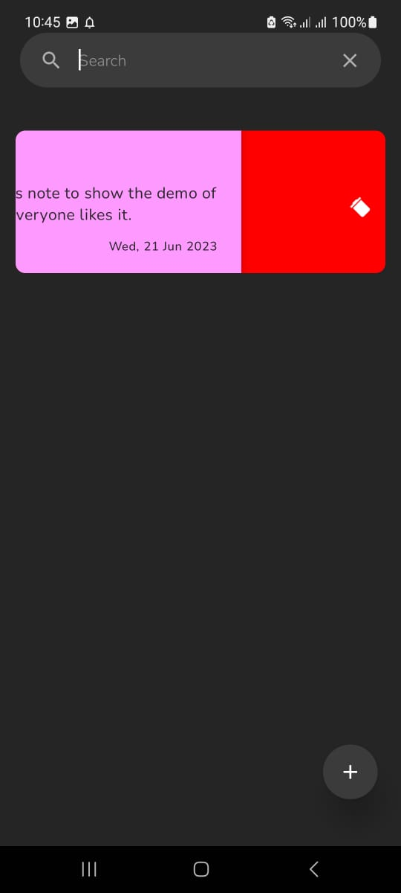
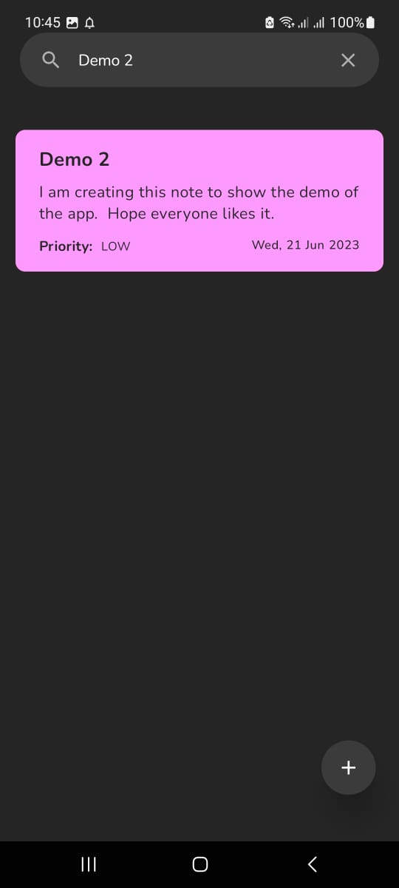
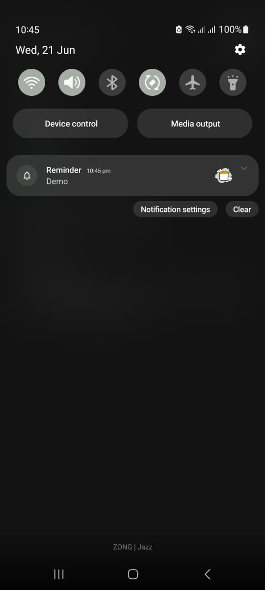

# Notes App

## Overview
The Notes App is an Android application built with Jetpack Compose, designed to help you efficiently create, edit, delete, search, sort, and set reminders for your notes. This app provides a seamless note-taking experience.

## Features

- **Create**: Easily create new notes with a few taps, allowing you to capture your thoughts and ideas instantly.
- **Edit**: Effortlessly edit your existing notes, making refining and updating your content simple.
- **Delete**: Remove unwanted notes quickly and efficiently, helping you stay organized and clutter-free.
- **Search**: Seamlessly search through your notes using keywords, ensuring you can find what you need in a snap.
- **Sort**: Sort your notes by various criteria such as date, title, or priority, enabling you to prioritize and locate your notes more effectively.
- **Reminder**: Set reminders for important notes, ensuring you never miss a deadline or forget a crucial task.

## Screenshots

Add Note              |  Home Screen
:-------------------------:|:-------------------------:
   |   

Edit Note                  | Delete Note
:-------------------------:|:-------------------------:
    |   

Search Note                | Reminder Notification
:-------------------------:|:-------------------------:
    |   

## Installation
1. Clone this repository: `git clone https://github.com/your-username/notes-app.git`
2. Open the project in Android Studio.
3. Build and run the app on an emulator or physical device.

## Requirements
- Android Studio Arctic Fox (2020.3.1) or newer
- Android API level 26 or higher

## Dependencies
- Jetpack Compose: UI toolkit for building native Android apps
- Room: Database library for storing notes
- Coroutines: Asynchronous programming library for managing background tasks
- Material Design Components: UI components for consistent and beautiful app design
- Android Architecture Components: Lifecycle-aware components for building robust and maintainable apps

## Usage
1. Launch the app on your Android device.
2. Tap the "+" button to create a new note.
3. Enter the title and description along with the priority of the note.
4. Use the date time input option to set reminders.
5. Swipe left to delete specific notes.
6. Tap on a note to view or edit its details.
7. Sort notes using the sorting icon in the toolbar.
8. Search notes using the search icon in the toolbar.
9. Sort notes using the sort icon in the toolbar.
10. Enjoy a seamless note-taking experience!

## Contribution
Contributions are welcome! If you have any suggestions, bug reports, or feature requests, please open an issue or submit a pull request. We appreciate your valuable input!

## License
This project is licensed under the [MIT License](/path/to/LICENSE).
